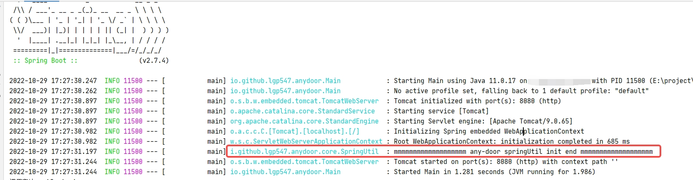

# AnyDoor 任意门
简单来说就是执行任意对象的任意方法

需要是Spring web项目，会在原有项目提供一个对外的路径(/any_door/run)，该路径可以调用到任意一个方法


## 快速使用
推荐结合IDEA插件使用！插件帮做了导入jar包以及封装了调用接口，做到快速使用

### IDEA插件使用
本插件只需每个项目配置一次即可

详情见 https://github.com/lgp547/any-door-plugin

### 常规使用
#### 添加依赖
```xml
<dependency>
    <groupId>io.github.lgp547</groupId>
    <artifactId>any-door</artifactId>
    <version>0.0.2</version>
</dependency>
```

#### 启动项目
有打印出日记说明添加成功（是info级别）


#### 调用接口

路径：/any_door/run

端口：既是启动项目所在的端口

参数说明：
- className      要调用的类的全链路名
- methodName     要调用的方法名
- content        入参参数，要求是json类型（允许为null）
- parameterTypes 参数类型 （若是方法名是唯一的，允许为空）

```shell script
curl --location --request GET 'http://localhost:8080/any_door/run'
--header 'Content-Type: application/json' \
--data-raw '{
    "content": {"name":"any_door"},
    "methodName": "oneParam",
    "className": "io.github.lgp547.anydoor.core.Bean",
    "parameterTypes": []
}'
```
## 发布版本
### 0.0.2
- 支持Bean私有方法
- 支持空字符串要解析成对象，不再是null
- 支持没有注册Spring对象进行执行
- 打印响应结果
- 调用的方法是否会走代理？会走
- 修复null参数
- 修复String类型
- 修复List类型的泛型映射

## 适合场景
- xxlJob
- rpc
- mq入口
- 小改动的测试


## 后续支持
- 对于没有注册到Spring类，并且没有无参构造函数的类进行支持
- 对于Dao层进行支持，目前会有丢失参数的情况、增加测试方法
- 对LocalDateTime(OffsetDateTime)的支持、增加测试方法
- 对于不支持的类型，那就直接null进去
- 返回值的打印并不必要，错误的话直接忽略
