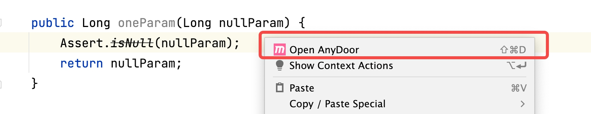

# AnyDoorPlugin 任意门插件

执行Spring web项目任意对象的任意方法

## 适合场景
对于没有http接口的方法，又想快速进行测试，这个时候即可用到。

常见场景：
- XxlJob的注解入口
- RPC的入口
- MQ入口
- 一个里层方法修改后，想快速验证一下是否正确

## 快速开始
每个项目只需要初始化一次即可
### 安装插件
插件市场直接搜索 anydoor 支持IDEA版本：2021.*~2022.3

### 配置插件属性并进行导入
1. 配置项目属性
2. 点击Try按钮（成功or失败会有消息提示）

导入成功

### 启动项目
Run or Debug

### 执行调用
1. 找到想要执行的方法，右键弹出选择打开任意门（有对应的快捷键）

2. 填写要调用的参数，并执行启动！

3. 你将会发现当前方法被执行了！（可进行断点查看） 

**注意** 若项目是有接口权限控制的，需要放行'/any_door/run'

## 插件原理
分两件事：导入jar包、调用项目接口
### 导入jar包

导入jar包，实际就是优先本地的AnyDoor的jar包导入到当前项目模块（若本地Maven配置目录没有，将会从中央仓库下载并放到本地仓库），

导入成功后可以在设置页面查看，当然删除也是在这里

### 调用项目接口
就是HTTP请求，[任意门AnyDoor](https://github.com/lgp547/any-door) 项目开放的路径

## 发布版本
### 1.0.0
- [x] 对于没有参数的直接进行调用
- [x] 参数缓存
- [x] 调度任意门接口报错增加错误提示

### 1.0.2
- [x] 非固定窗口（非模态对话框）
- [x] 增加快捷键直接调用当前方法（无须在具体方法名上）
- [x] 调整方法选中的先后顺序
- [x] jar包版本升级为0.0.3

## 后续支持
- [ ] **重要功能** 搜索运行模块名的代码优化（目前会有不支持的情况）
- [ ] **重要功能** 不依赖端口号进行调度到执行的项目
- [ ] 参数窗口，对于是复杂对象的并且没有缓存，直接生成json格式内容
- [ ] 参数窗口，增加：'reset simple'、'reset json'、'format'按钮
- [ ] 可以支持query类型的入参
- [ ] 增加清除所有缓存，显示缓存文件大小
- [ ] 考虑：是否不使用Map，使用1年过期的缓存呢？
- [ ] 考虑：窗口内直接执行想测试的代码（打开计算窗口）
- [ ] 多模块下，或有重名的model，无法进行导入依赖

- [ ] jar包打印版本和端口号
- [ ] 插件调整到 其他setting