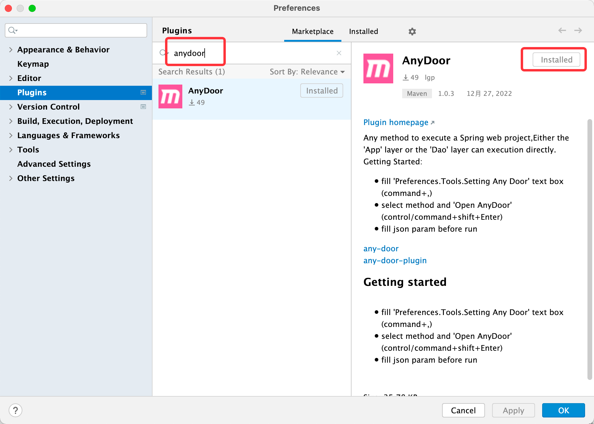
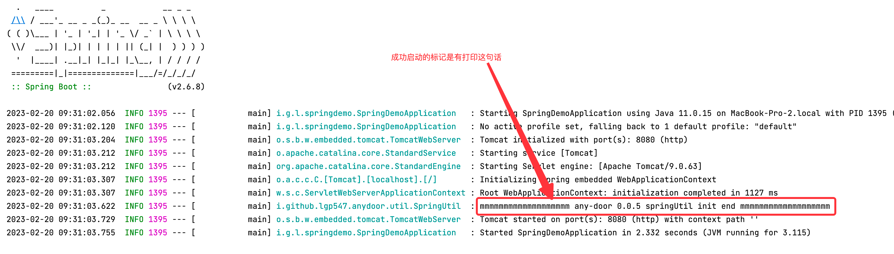
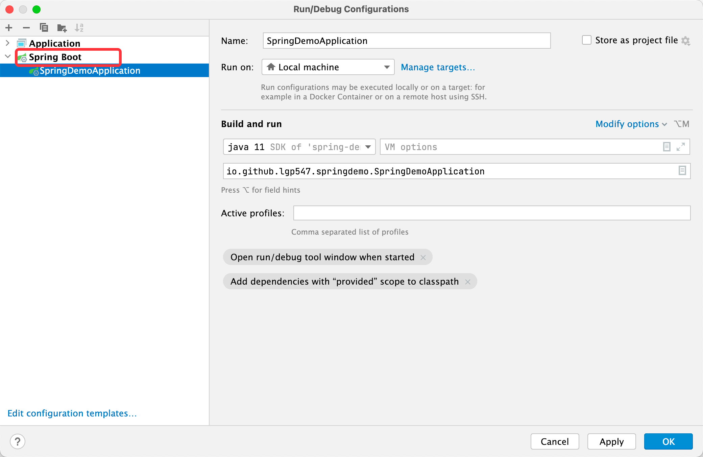
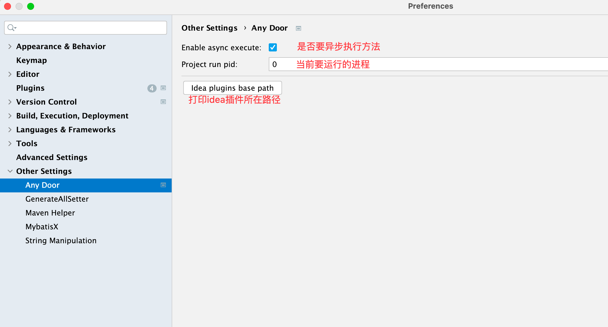
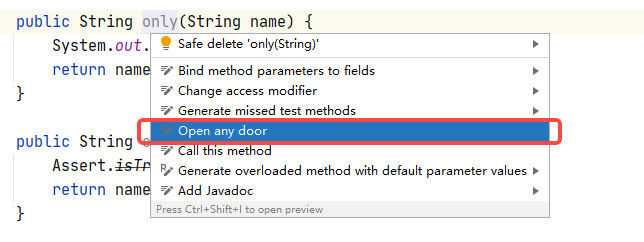
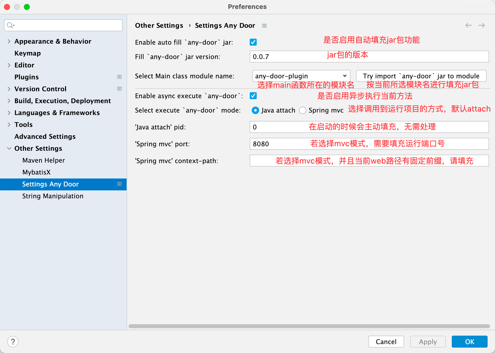
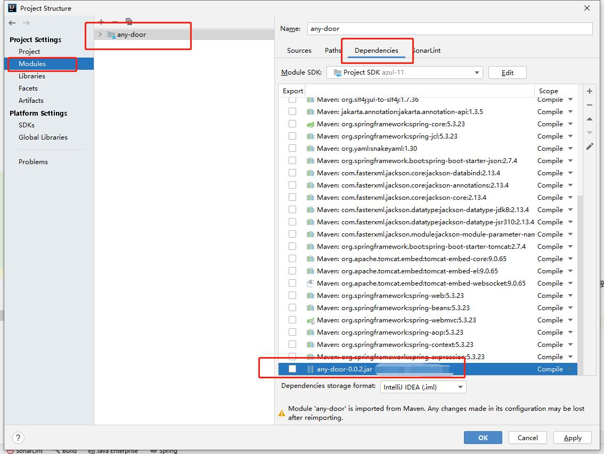
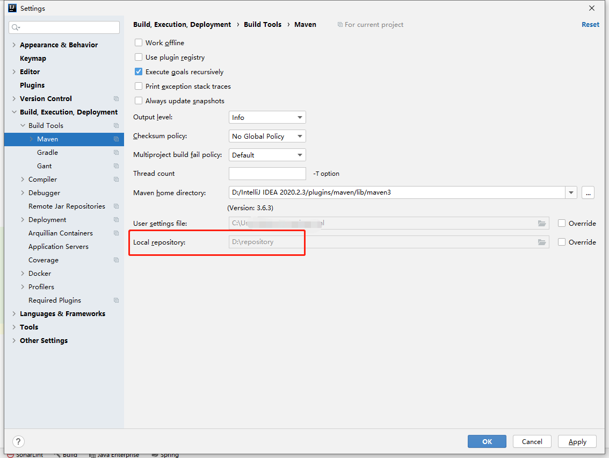

# AnyDoorPlugin 任意门插件

执行Spring boot项目任意对象的任意方法

## 适合场景
对于没有http接口的方法，又想快速进行测试，这个时候即可用到。

常见场景：
- XxlJob 的入口
- RPC 的入口
- MQ 入口
- 一个里层方法修改后，想快速验证一下是否正确

## 功能展示

## 支持功能
- **核心** 调度任意方法
- 不依赖 Spring MVC 端口也可执行
- 执行参数将会缓存
- spring boot 项目会主动填充依赖 jar 包

## 快速开始
### 1 安装插件
插件市场直接搜索 anydoor 

### 2 启动项目
插件正常使用前提标记

启动项目分自动挡和手动档两种情况，自动挡需要满足下面三个要求
- IDEA 是 Ultimate 版本
- IDEA 版本 >= 2021.4
- 运行的是 Spring boot 项目

#### 2.1 符合自动挡
直接启动项目即可

#### 2.2 手动档
1. 打开 IDEA 的 Preferences 配置，找到 `Settings Any Door` 

2. 选择 main 函数所在的模块，并点击尝试导入 jar 包按钮

导入成功所示：

### 3 执行调用
1. 找到想要执行的方法，右键弹出选择打开任意门（有对应的快捷键）

2. 填写要调用的参数，并点击 ok 按钮

3. **你将会发现当前方法被执行了！（可进行断点查看）**

## 插件属性说明

## 注意事项
- 首次使用本插件建议能访问外网Maven中央仓库。因为本地 Maven 仓库没有对应的 [AnyDoor](https://github.com/lgp547/any-door) jar 包版本将会发起请求下载到本地仓库

- 若选择mvc模式调度到运行项目
  - 需要手动填充端口号和web的前缀
  - 若是有接口权限控制的，需要放行 '/any_door/run' 路径

## 插件原理
分两件事：导入jar包、调用项目接口
### 导入jar包

导入jar包，实际就是优先本地的AnyDoor的jar包导入到当前项目模块（若本地Maven配置目录没有，将会从中央仓库下载并放到本地仓库），

导入成功后可以在设置页面查看，当然删除也是在这里

### 调用项目
分两种方式，Java attach 和 Spring mvc 。推荐是默认的 attach 方式。

- attach：
  - 通过jvm提供的功能，直接通过进程号进行跨进程调度
- mvc
  - 就是HTTP请求，请求指定端口的 '/any_door/run' 路径

详情见 [任意门AnyDoor](https://github.com/lgp547/any-door)

## 发布版本
### 1.0.0
- [x] 对于没有参数的直接进行调用
- [x] 参数缓存
- [x] 调度任意门接口报错增加错误提示

### 1.0.2
- [x] 非固定窗口（非模态对话框）
- [x] 增加快捷键直接调用当前方法（无须在具体方法名上）
- [x] 调整方法选中的先后顺序
- [x] jar包版本升级为0.0.3

### 1.0.4
- [x] 插件调整到 其他setting
- [x] 填充模块名变成可选文本框
- [x] 参数窗口，默认弹出获取输入焦点

### 1.0.5 & 1.0.6
- [x] spring boot项目才做主动填充。2021.4 版本要求 https://youtrack.jetbrains.com/issue/IDEA-272959
- [x] 支持参数json格式
- [x] 支持增加webPathPrefix
  
### 1.0.7 & 1.0.8
- [x] 支持通过Java attach调度的运行项目，不再强依赖MVC端口
- [x] 配置页面进行调整，区分不同的调度方式，以及更合理的排版

## 后续支持
详情见issues

