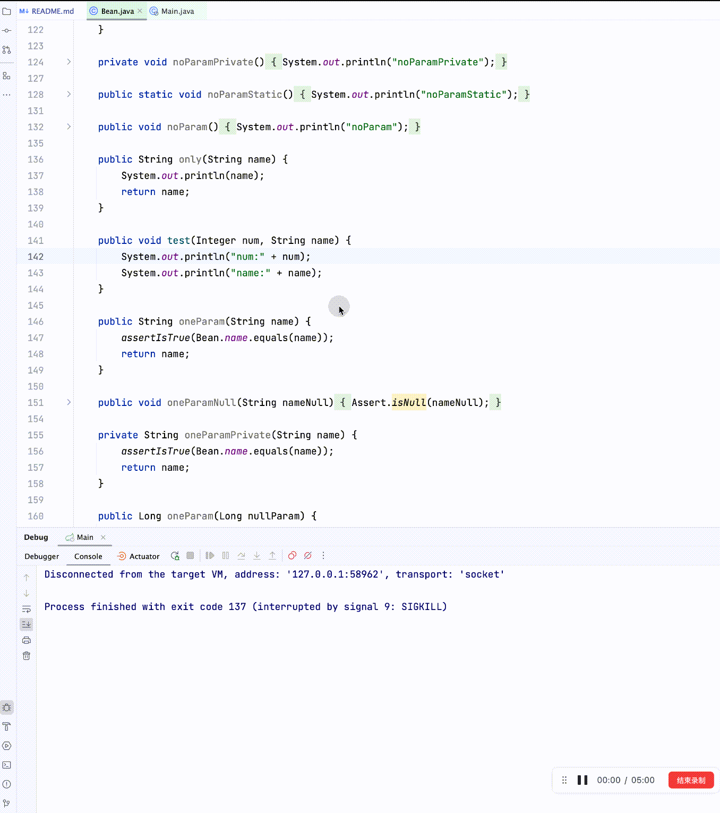
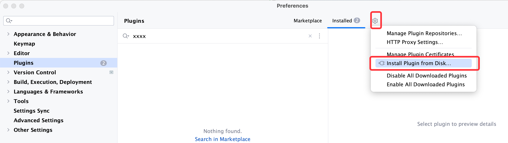
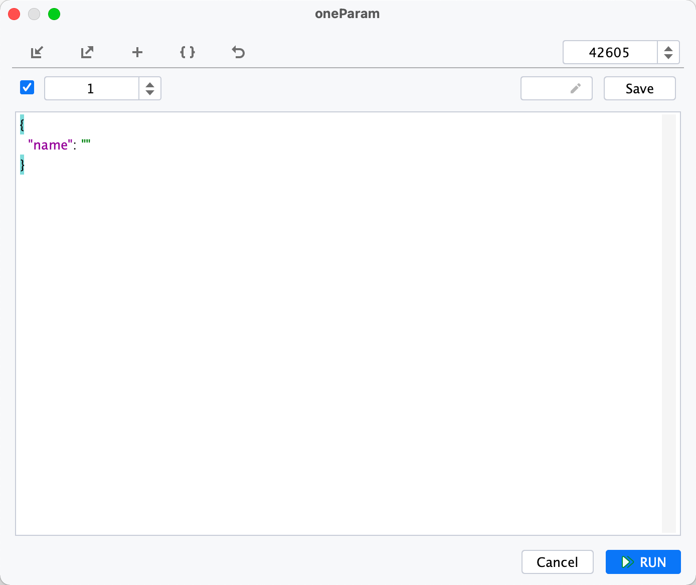
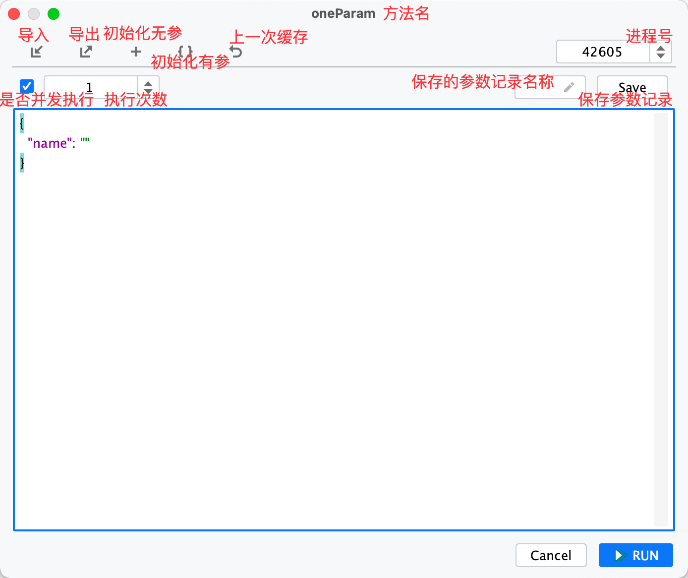

# AnyDoor 任意门

目标：执行Spring项目任意对象的任意方法

执行项目的任意方法提出者：[Lin ZiHao](https://github.com/schneiderlin)

## 适合场景
- xxlJob
- rpc入口
- mq入口
- 改动的测试

**Tips：配合热加载可以做到随时修改即可测试**

## 功能展示

## 快速开始（结合插件）
总结：安装插件 -> 启动项目 -> 右键方法 -> 填写参数 -> Run
### 1 安装插件
1.1安装，方便快捷，但需要自由上网（**推荐**）

1.2安装，提供了国内下载地址，但需要手动导入

#### 1.1 直接插件市场下载（推荐）
插件市场直接搜索 anydoor

#### 1.2 下载提供的压缩包
下载完成后导入到idea [国内下载地址](https://gitee.com/lgp547/any-door-plugin-download)

### 2 启动项目
平常方式启动java的main函数

Tips：一般情况下会主动填充运行进程的进程id（可在配置页面修改）

### 3 执行调用
1. 找到想要执行的方法，右键弹出选择打开任意门（有对应的快捷键 control/command+shift+D）

2. 填写要调用的参数，并点击 ok 按钮

3. **你将会发现当前方法被执行了！（可进行断点查看）**

## 插件属性说明

## 核心包支持功能
- 对象相关：
  - 对于是Spring注册的Bean，会通过上下文拿到对象（若有代理既是代理对象），执行当前方法
  - 对于非Spring注册的Bean，会通过反射创建对象，执行当前方法
- 方法相关：
  - 支持同步或异步执行当前方法，默认异步
  - 支持私有方法
  - 打印响应结果
- 参数相关：
  - 对给的参数进行序列化，支持json格式
  - 函数的参数支持lambda表达式入参，例如：Function的可以 `A -> A`
  - 时间支持：LocalDateTime传yyyy-MM-dd'T'HH:mm:ss、yyyy-MM-dd HH:mm:ss、yyyy-MM-dd

## 插件支持功能
- 执行参数将会缓存
- 可在任意地方重复上一次的调用
- 配置页面可打印Idea插件的路径
- 保留通过Http进行调用

## 地址
[AnyDoorPlugin-idea插件中心](https://plugins.jetbrains.com/plugin/20385-anydoor)

## 后续支持
详情见issues

## 发布版本
### 2.1.3 修复版本
- 支持IDEA的24.1版本
- 返回值是Optional类型直接打印内容
- [fix]增加jsonKey判断逻辑

### 2.1.2 修复版本
- 支持23.3版本
- [fix]jsonKey的判断
- [fix]批量情况接口的参数传递

### 2.1.1 代码提示和导航+批量参数+修复
- 增加参数窗口填写Key的时候代码完成提示
- 增加参数窗口Key的导航跳转
- 支持批量参数批量的调用（数组格式）
- [fix]打开参数窗口遇到文件失效
- [fix]在黑色主题下窗口背景颜色不正确

### 2.0.2 修复版本
- [fix]修复获取不到bean的情况

### 2.0.1 修复版本
- [fix]修复私有方法丢失依赖

### 2.0.0 团队参数共享
- 团队协助，共享调用参数 [@zhouhao91](https://github.com/zhouhao91)
- ui页面优化 [@zhouhao91](https://github.com/zhouhao91)
- [fix]无提供spring项目的调用
- [fix]懒加载情况下会有无法实例化类情况
- [fix]参数传递中文路径
- [fix]重载方法参数有基本数据类型时报错问题 [@jinghong](https://github.com/auto-generated)

### 1.4.0 类加载隔离
- 类加载隔离，和运行项目不做耦合，无依赖冲突问题
- 支持没有 Spring 依赖的 Java 项目，插件运行无需使用方提供 Spring 依赖
- 一个类多实例将会随机取一个实例
- [fix]无参方法无记录上一次调用

## 感谢
Tips：若觉得不错，可以点个Star(✨✨)或者[评价](https://plugins.jetbrains.com/plugin/20385-anydoor/reviews/new)下

Tips：若觉得**很不错或支持项目**，可以[❤️❤️❤️赞赏❤️❤️❤️](dosc%2F%E8%B5%9E%E8%B5%8F%E9%A1%B5.md)

> 感谢以下项目支持
> - [arthas](https://github.com/alibaba/arthas)
> - [jackson](https://github.com/FasterXML/jackson)
> - [lambda-from-string](https://github.com/greenjoe/lambdaFromString)

